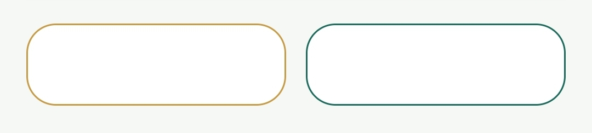
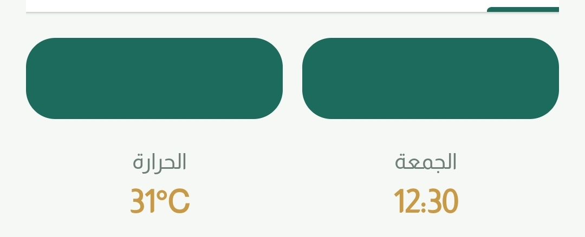
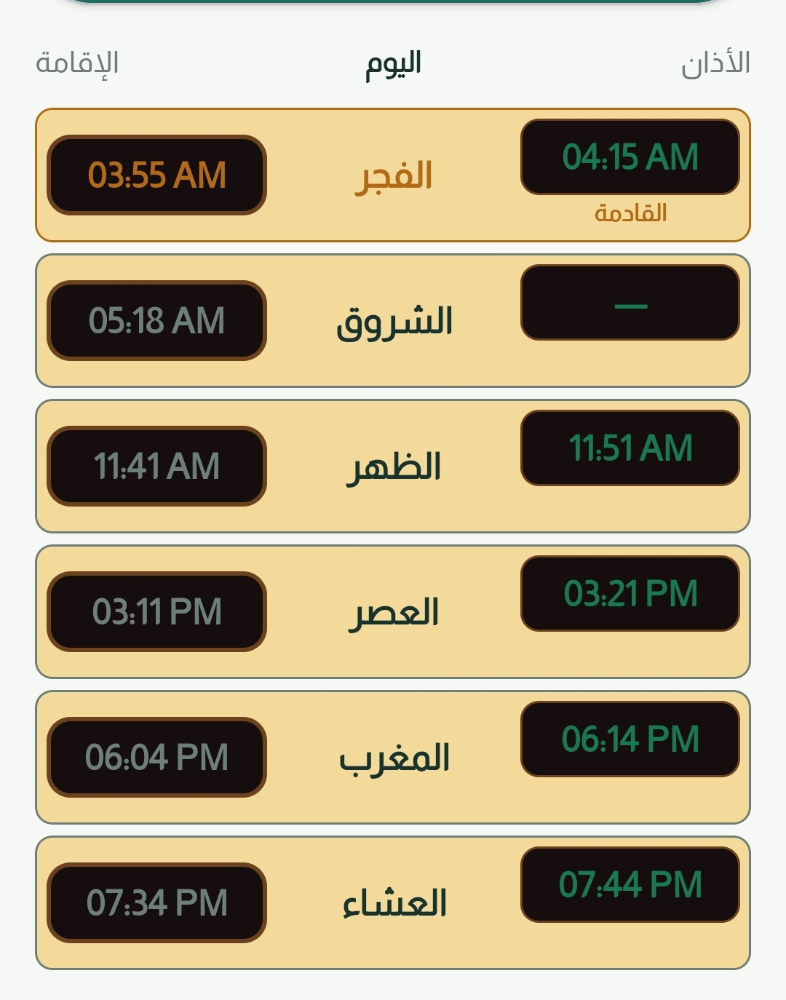
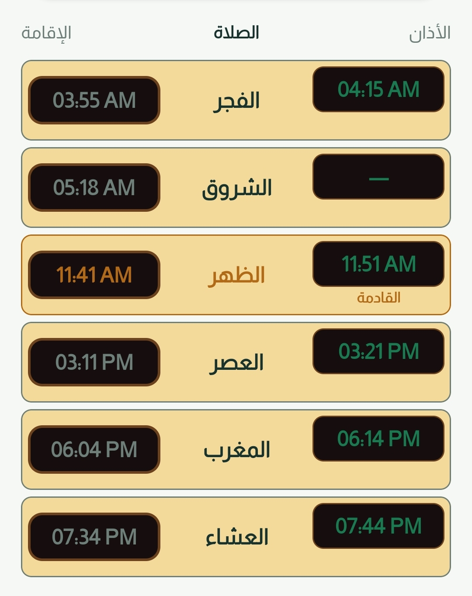

# MIRQAT | مرقات

> **MIRQAT** is a professional, ad-free Islamic assistant designed to bring prayer, Quran, daily worship tools, and mosque-oriented utilities into one calm native mobile experience.

## About the project

This repository is a **public showcase and concept presentation only**. It is intended to document the product vision, visual direction, and feature set of MIRQAT for portfolio and public presentation purposes.

The Android source code, iOS source code, build configuration, private assets, backend configuration, signing material, and production release files are **not included** in this repository.

## Product highlights

MIRQAT is designed around an ad-free and privacy-conscious experience with offline-first content wherever practical. The product direction includes a smart prayer board, location-aware prayer times, multiple calculation methods, Arabic and multilingual localization, Quran reading, Adhkar, Names of Allah, Qibla, daily prayer tools, Zakat and inheritance calculators, Umrah guidance, local backup and restore, and Smart Mosque Mode reminders before Iqamah.

## Visual identity

The visual language combines quiet Islamic emerald tones, warm gold accents, generous spacing, rounded cards, Almarai typography, and a clear information hierarchy. The interface is intended to support both Arabic RTL and English LTR layouts, light and dark themes, phone screens, tablets, and landscape mosque-display layouts.

## Screenshots

### Prayer board

### Features

### Tools

### Quran experience

## Ownership and usage

MIRQAT, its name, branding, visual identity, product concept, screenshots, documentation, and related materials are the property of **MHD Media / Eng. Mohammed Bin Aqeel**, copyright 2026, unless a file states otherwise.

This public repository does **not** grant permission to copy, reproduce, modify, redistribute, commercialize, reverse engineer, or create derivative products from the MIRQAT concept, branding, screenshots, or materials. See [LICENSE](LICENSE) for the full terms.

For licensing, partnership, or authorized collaboration inquiries, contact: `benaqel@internet.ru`.

## Important notice

A public showcase can communicate authorship and product history, but it cannot technically prevent others from independently developing similar ideas. The implementation source remains private and is intentionally excluded from this repository.
